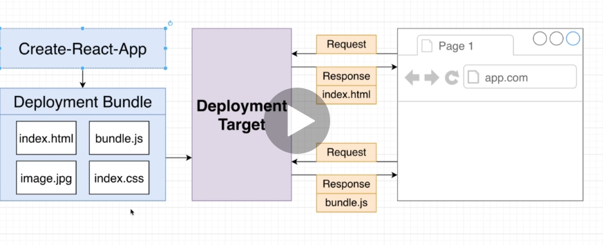
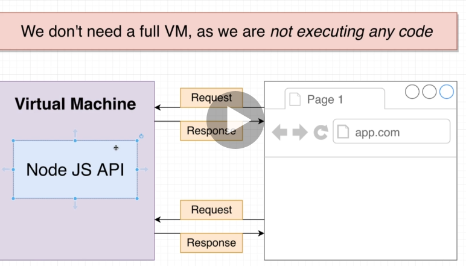
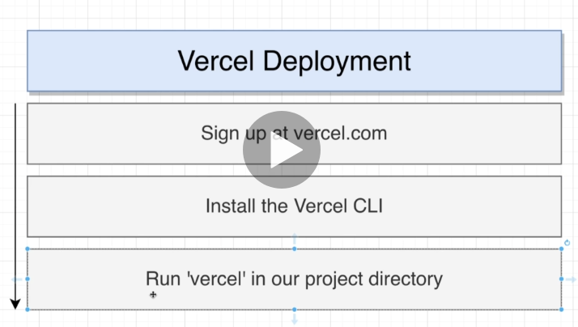
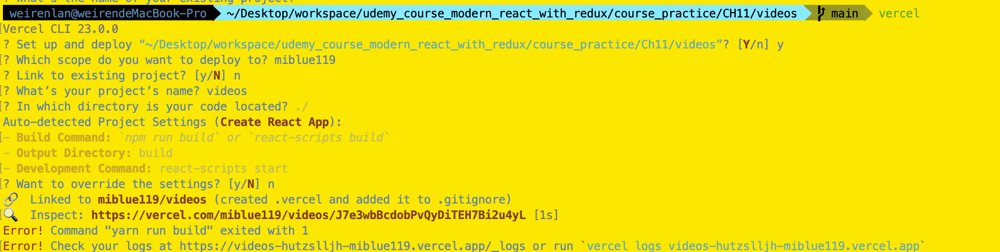
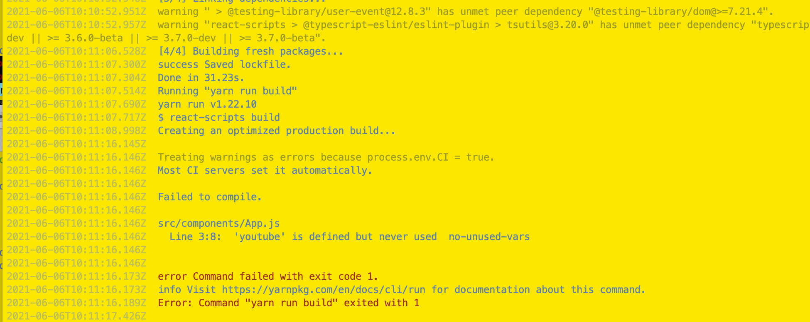
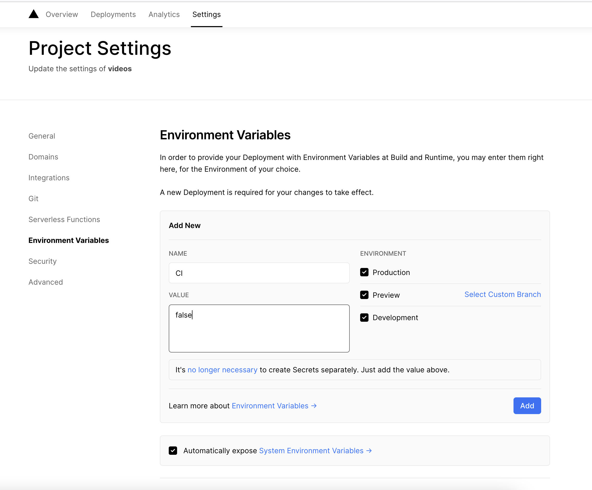
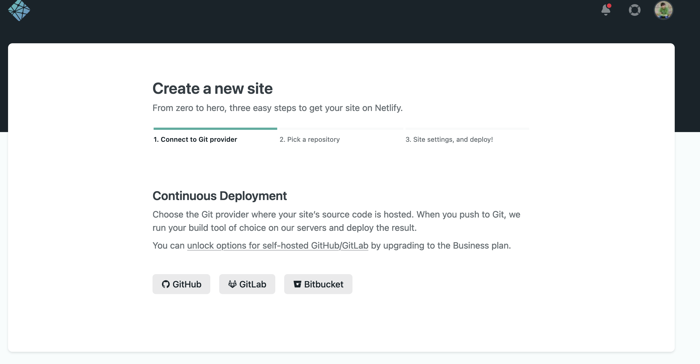
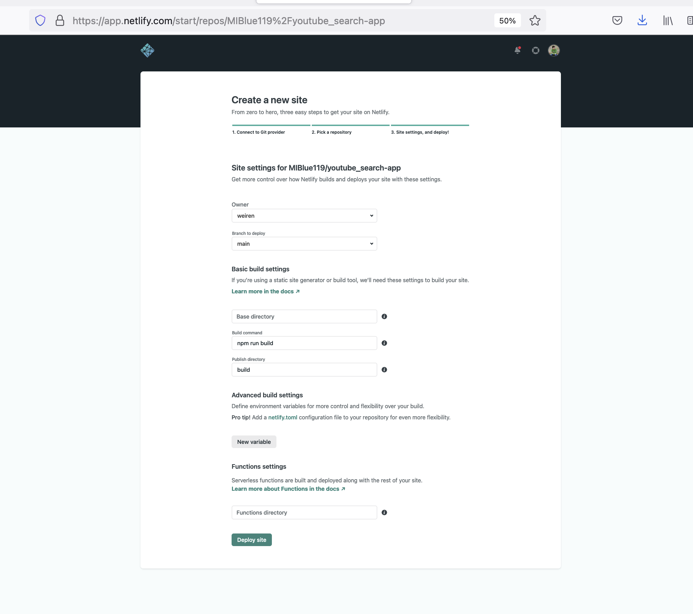
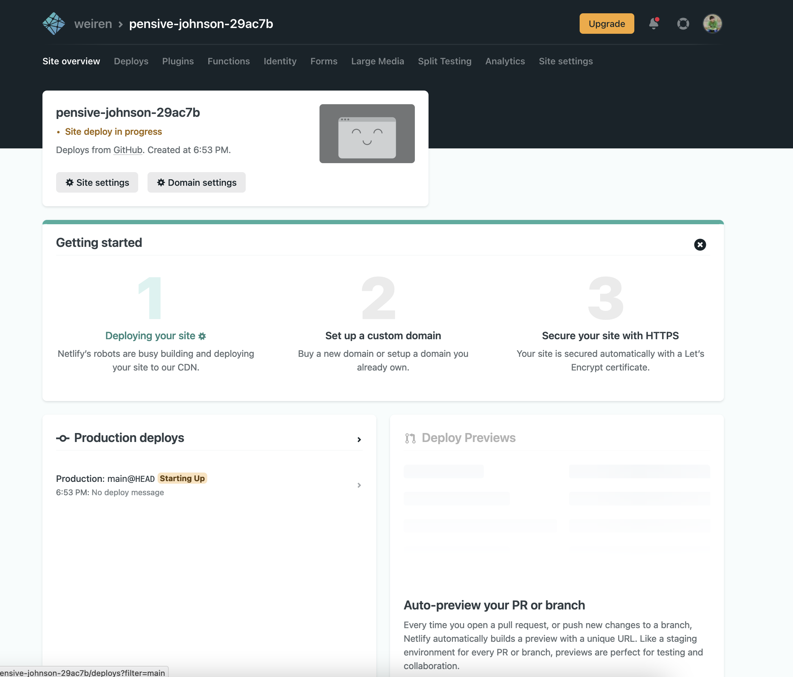
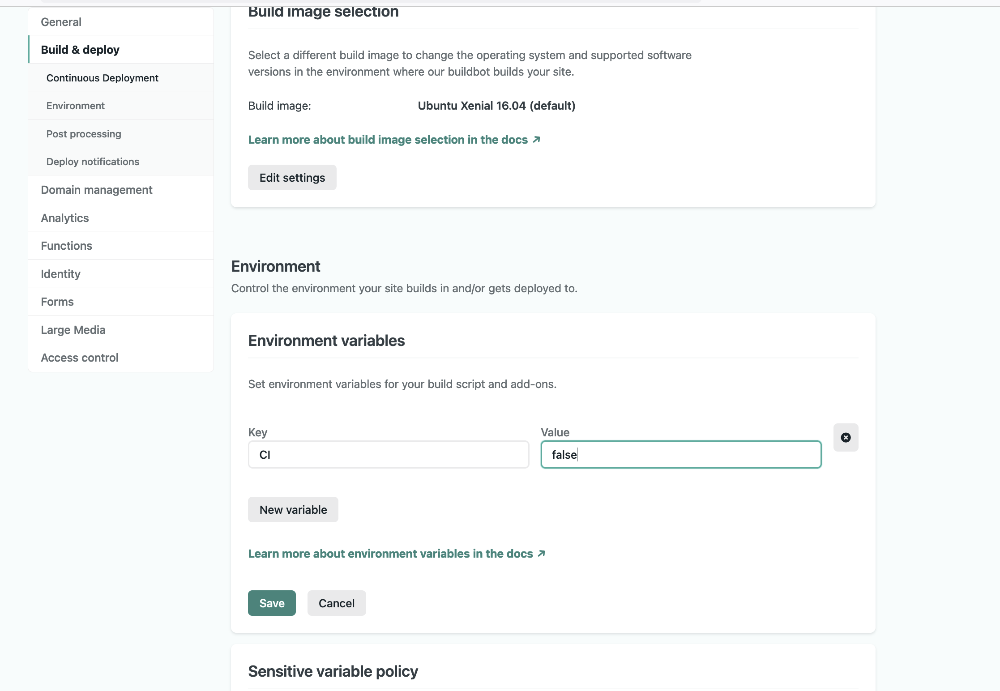

# How could we deploy our React App






If we just want to deploy static file to serve

VM cost much money to wrong.
static files cost free.

## Example 
### Deploy the app to Vercel
link:https://vercel.com/


Vercel Deployment
- Sign up at vercel.com
- Install the Vercel CLI
```
$npm install -g vercel
```    
- Run 'vercel' in our project directory
    - Sign in 
    ```
    $vercel login
    ```    
    - Choose the email related to the account to login
- Build the vercel
    ```
    $vercel
    ```



- How could we solve the error?
    Because we met the problem by treat the warning as error by the CI setting. We need to reset the setting at .

    https://github.com/vercel/vercel/discussions/5566




After set the CI to close.
Run the command $vercel again


- How could we redploy our Application???
If we update our code, we could usethis command
```
vercel --prod
```


### Deploy to Netlify

https://www.netlify.com/










Netlify would detect the push to the github and rebuild again.